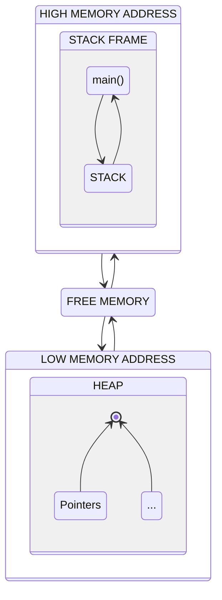

<div align='center'>

  

# Rust Memory Layout

Detailing the Memory Layout behind the Rust Language

<br>
<br>
<br>

</div>

## The Kernel Virtual Memory Space

-   Kernel virtual memory is the segment of virtual memory reserved for the operating system kernel. The virtual memory system, a memory management feature, allows the operating system to present the computer's physical memory to applications as a large and **contiguous block of memory**.

-   In the kernel's virtual memory, the operating system **keeps track of the memory pages that are currently being used** by the kernel and those that are available for use by applications. It also **maps physical memory addresses to virtual memory addresses to access hardware devices** and other system resources.

-   The kernel's virtual memory is usually divided into different regions, each of which serves a specific purpose. For example, one region might be used to **store kernel code and data**, while another might be used for **memory-mapped I/O**.

-   Virtual memory also allows the kernel to implement **memory protection**, which prevents applications from accessing memory they should not, such as that of other applications or the kernel. This is achieved by setting pages of memory with **specific access permissions**, such as **read-only** or **read-write**.

<table width="100%">
  <tr>
  <td width="20%" align=center>

<h1>Kernel Virtual Memory Space Overview</h1>

<kbd>
 <h3 align=center>&nbsp;&nbsp;&nbsp;HIGH MEMORY ADDRESS&nbsp;&nbsp;&nbsp;</h3>
</kbd>

...

| <h3>[STACK](#stack)<br>⟱</h3>                                            |
| ------------------------------------------------------------------------ |
| <div align=center>**main()**</div>                                       |
| <br><br><div align=center>free memory</div><br><br></img> |
| <h3 align=center>⟰<br>[HEAP](#heap)</h3>                                 |
| <div align=center>**Block Started by Symbol**</div>                      |
| <div align=center>**Data Segment**</div>                                 |
| <div align=center>**Text Segment**</div>                                 |

...

<kbd>
 <h3 align=center>&nbsp;&nbsp;&nbsp;LOW MEMORY ADDRESS&nbsp;&nbsp;&nbsp;</h3>
</kbd>

  </td>

  <td width="80%">

# [Memory Address Range](#memory-address-range)

### Basic x86-64 Linux ELF Binary

-   The memory address range is bounded by the `word` size of the `CPU`.
-   In a **64-bits** processor, the `word` size is **64 bits or 8 bytes per word**.
-   A **32-bits** processor can only address up to **2^32 or ~4GB** of [byte-addressable](https://en.wikipedia.org/wiki/Byte_addressing) memory. On the other hand **64-bits** processor can address from **0 to 2^64-1 or 16 billion GB**. Filling up the total memory is equivalent to turn every **0 bit into 1**
-   On **64-bits** `CPU` only **48-bits or ~281TB** is used for memory addressing with the remaining **16 bits** of the virtual address required to be all 0's or all 1's On a `64-bits CPU`, only **48 bits** or **256 TB** of memory addressing is supported, with the **remaining 16 bits** of the virtual address required to be either **all 0's or all 1's**.
-   Using the above as reference only **1-bit** is used for `kernelspace` and the rest is used for `userspace` memory.

# [Text Segment](#text-segment)

-   The text segment, aka the **code segment**, is where the `Rust` code is compiled by `LLVM` into `machine code` and **stored for later execution**. The actual execution of the machine code instructions typically occurs elsewhere in memory.

# [Data Segment](#data-segment)

-   The data segment in a program's memory layout is used to store **initialized variables**, which have a **defined value at runtime**.

# [BSS](#bss)

-   The Block Started by Symbol (BSS) section contains the uninitialized variables.

  </td>
  </tr>
</table>

<br>
<br>
<br>

## Rust Memory Layout Brief

-   In Rust, memory is organized into `stack`, `heap` and a special `static` memory region.

-   The `stack` is a region of memory that stores **local variables** and **function call frames**. It is fast, but has a fixed size. When a function is called, a new frame is **pushed onto the stack**, and when the function returns, the **frame is popped off**.

-   The **heap**, on the other hand, is a region of memory that can be **dynamically allocated and deallocated at runtime**. It is slower to access than the stack, but it can **grow** or **shrink** as needed. In Rust, heap-allocated memory is managed through the use of `smart pointers`, such as `Box<T>`, `Rc<T>` and `Arc<T>`. It is important to note that the smart pointers, like `Rc<T>` and `Arc<T>`, **do not automatically handle the allocation and deallocation of memory on the heap**. Instead, they do **reference counting**, which helps **manage the lifecycle of the memory allocation on the heap**.

-   In addition, Rust also has the concept of **"static variables"** which are stored in a **special** region of memory called the **static data segment**, which is a part of the **program's binary** and it's stored in the **read-only memory**. These variables have the **same lifetime as the program** and they are not bound to a specific scope.



# The [STACK](#stack)

> SAMPLE FUNCTION

```rust
fn main() {
  let a = 48;
  let b = double(a);
  println!("{b}");
}

fn double(n: i32) -> i32 {
  n * 2
}
```

<table width="100%">
  <tr>
  <td width="20%" align=center>

| <h3>[STACK](#stack)<br>⟱</h3>                                                                                                         |
| ------------------------------------------------------------------------------------------------------------------------------------- |
| <div align=center>**main()**<br><br><kbd>&nbsp;**a = 48**&nbsp;</kbd><br><kbd>&nbsp;**b = 96**&nbsp;</kbd></div>                      |
| <div align=center>**double()**<br><br><kbd>&nbsp;**n = 48**&nbsp;</kbd><br><kbd>&nbsp;**fn return addr 0x12f = 96**&nbsp;</kbd></div> |
| <br><br><div align=center>free memory</div><br><br></img>                                                              |
| <h3 align=center>⟰<br>[HEAP](#heap)</h3>                                                                                              |

  </td>

  <td width="80%">

# [STACK](#stack) Properties

-   The **stack** is a region of memory that operates in a **last-in, first-out (LIFO)** manner, and is used to store **temporary data for function calls and other operations**.
-   The **stack** memory grows **towards lower memory addresses**, starting from a [higher address](#high-memory-address) of about `0x7fffffffffff`.
-   It is an **abstraction concept** that is used to create **processes/threads** in an operating system, and is commonly found in most programs.
-   Each process starts a **single thread by default** and each process has its **own separate stack**. Each process typically starts with a **single thread**, and **each thread has its own separate stack**.
-   The **default stack size** in a 64-bit Rust program is 2MB, but it can grow up to a **limit of 8MB**.
-   If your program **exceeds the stack size limit**, you may encounter a **"stack overflow" error**.
-   The size of the `stack pointer` is determined by its data type. For example, a `i32` requires **4 bytes**, and a `i64` requires **8 bytes**.
-   Because the stack is statically allocated, it **does not need to be resized using system calls during runtime, which can make execution faster**.

  </td>
  </tr>
</table>

🦀 **Depicting the sample function memory allocation in a 64-bit OS:**

1. A `stack frame` is created for the `main()` function and the `stack pointer` is updated to point to the **new stack frame**. The local variable `a` is stored in the **stack frame and takes up 4 bytes of memory**.

2. When the variable `b` calls the function `double()`, a **new stack frame is created for the `double()` function**. The stack pointer is updated to point to the new stack frame, but the **change in the stack pointer depends on the size of the function arguments and local variables**.

3. The parameter `n` is stored in the stack frame for the `double()` function and takes up 4 bytes of memory. The **return address is stored in the stack**, and its size **depends on the architecture** of the system and the operating system.

4. The `double()` function terminates and the operating system **deallocates the stack frame for the `double()` function**. The stack pointer is updated to point to the previous stack frame, and the return value is stored in the variable `b` in the `main()` function. The `main()` function ends and the whole program terminates.

<br><br><br>

# The [HEAP](#heap)

> SAMPLE FUNCTION

```rust
fn main() {
  let heap = boxed_value();
  println!("{heap}");
}

fn boxed_value() -> Box<i32> {
  let result = Box::new(99);
  result
}
```

<table width="100%">
  <tr>
  <td width="20%" align=center>

| <h3>[STACK](#stack)<br>⟱</h3>                                                                                                                    |
| ------------------------------------------------------------------------------------------------------------------------------------------------ |
| <div align=center>**main()**<br><br><kbd>&nbsp;**heap = 0x6f32**&nbsp;</kbd></div>                                                               |
| <div align=center>**boxed_value()**<br><br><kbd>&nbsp;**result = 99**&nbsp;</kbd><br><kbd>&nbsp;**fn return addr 0x6f32 (99)**&nbsp;</kbd></div> |
| <br><br><div align=center>free memory</div><br><br></img>                                                                         |
| <div align=center><kbd>&nbsp;**heap addr 0x6f32 (99)**&nbsp;</kbd></div>                                                                         |
| <h3 align=center>⟰<br>[HEAP](#heap)</h3>                                                                                                         |

  </td>

  <td width="80%">

# [HEAP](#heap) Properties

-   The `Heap` is another abstraction that, unlike `Stack`, has a **flexible size** that can change over time (like in **run time**).
-   Instead of one `Stack Frame` for each thread the `Heap` memory region has a large **shared memory with the `Stack` memory region**.
-   The `Heap` memory **grows upwards** starting from the [lower address](#low-memory-address).
-   While the program is running the `Heap` memory region **grows automatically** if the allocated memory is not enough and **shrinks if dropped** (calling the `drop()` method early or when the function ends).
    > To optimize the amount of system calls to a minimum you can try to allocate all the memory at once in one `Vec` with enough capacity **if you know how much memory your program needs beforehand**.
-   The `Heap` is **not stored** inside the binary and is discarded after the program execution.
-   Its size limit is bounded by the system's memory.
-   Each `Heap` **value size** is determined by the **data type**.
-   Because of its **dynanmic** nature it needs to make system calls to ask for more space (using the **GlobalAlloc Trait that calls C malloc**) as soon as requested thus adding a little overhead. This process is done in **chunks to make as few system calls as possible**. Even using this technique this process turns the `Heap` slower than the `Stack` memory.
-   When a variable goes out of scope (dropped) the memory is **freed but not returned immediately to the OS**. The memory allocator keeps track of the **OS memory pages** to know which pages are **free** and which are **allocated**. This process is a way to **prevent more system calls** and **reuse** the available memory without waiting for the OS thus speeding things up.
-   The access to the `Heap` is also slower than on the `Stack` because we have the additional step of **following a pointer** to the value.

  </td>
  </tr>
</table>

🦀 **Depicting the sample function memory allocation in a 64-bit OS:**

1.  The `main()` function creates a new `Stack Frame`. The **stack pointer increases 8 bytes** and the variable `Heap` calls the function `boxed_value()`.

2.  The `boxed_value()` **stack pointer increases 8 bytes again** and we also have a local variable called `result` that has a `Box` with a value inside. The **`Box` acts as a pointer** so the return value size is **8 bytes** as well (the `Heap` variable in `main()` will be the same **8 bytes but as an address pointing to the `Heap Memory`**). Inside the `Box` we have a `99` value which is an `i32` so we need to reserve **4 bytes but this time on the heap**. The function ends, **deallocates and decreases the stack pointer by 8 bytes**.

3.  The **pointer** goes back to the `main()` and the **heap variable** now receives a **copied address** of the value stored in the shared `Heap Memory`. Finally the function runs and terminates the program.

# [DATA TYPES](#data-types)


```rust
DATA TYPE | EXAMPLE
--------- | ------------------------------------------------
i8        ⮑ let data: i8 = -100;
i16       ⮑ let data: i16 = -32_000;
i32       ⮑ let data: i32 = -2_147_483_648;
i64       ⮑ let data: i64 = -9_223_372_036_854_775_808;
i128      ⮑ let data: i128 = -170_141_183_460_469_231...;
isize     ⮑ let data: isize = {i32 or i64, OS dependent};
u8        ⮑ let data: u8 = 255;
u16       ⮑ let data: u16 = 65535;
u32       ⮑ let data: u32 = 4_294_967_295;
u64       ⮑ let data: u64 = 18_446_744_073_709_551_615;
u128      ⮑ let data: u128 = 340_282_366_920_938_463...;
usize     ⮑ let data: usize = {u32 or u64, OS dependent};
f32       ⮑ let data: f32 = 3.14;
f64       ⮑ let data: f64 = 3.141592653589793238;
bool      ⮑ let data: bool = true;
char      ⮑ let data: char = 'z';
str       ⮑ let data: &str = "Hello, world!";
array     ⮑ let data: [i32; 5] = [1, 2, 3, 4, 5];
tuple     ⮑ let data: (i32, f64, &str) = (500, 6.4, "hello");
slice     ⮑ let data: &[i32] = &[1, 2, 3][..];
unit type ⮑ let data: () = ();
function  ⮑ fn main() {}
struct    ⮑ struct User { name: String, age: u32 }
enum      ⮑ enum Color { Red, Green, Blue }
traits    ⮑ trait Summary { fn summarize(&self) -> String; }
reference ⮑ let data: &i32 = &1;
Vec       ⮑ let data: Vec<i32> = vec![1, 2, 3];
String    ⮑ let data: String = String::from("hello");


SMART POINTER | EXAMPLE
------------- | ------------------------------------------------------
Box<T>        ⮑ let data: Box<i32> = Box::new(5);
Rc<T>         ⮑ let rc_type: Rc<i32> = Rc::new(5);
Weak<T>       ⮑ let data: Weak<i32> = Weak::downgrade(&rc_type);
Arc<T>        ⮑ let data: Arc<i32> = Arc::new(5);
RefCell<T>    ⮑ let data: RefCell<i32> = RefCell::new(5);
Cell<T>       ⮑ let data: RefCell<Cell<i32>> = RefCell::new(Cell::new(5));


ASYNC TYPE           | EXAMPLE
-------------------- | ------------------------------------------------------
Future               ⮑ let future: Future = async { 5 };
Stream               ⮑ let stream: Stream = (0..5).into_stream();
Pin                  ⮑ let pin: Pin = Pin::new(future);
JoinHandle           ⮑ let handle: JoinHandle = tokio::spawn(async {});
Poll                 ⮑ let poll: Poll = future.poll();
Ready                ⮑ let ready: Ready = Poll::Ready(5);
Pending              ⮑ let pending: Pending = Poll::Pending;
Task                 ⮑ let task: Task = tokio::spawn(async {});
Context              ⮑ let context: Context = &mut Context::from_waker(waker);
Waker                ⮑ let waker: Waker = noop_waker();


CONCURRENCY + ASYNC     | EXAMPLE
----------------------- | ---------------------------------------------------
std::thread             ⮑ thread::spawn( move || { })
std::sync::mpsc         ⮑ let (tx, rx) = mpsc::channel();
std::thread::JoinHandle ⮑ let handle = std::thread::spawn(move || {});
                           handle.join();
tokio::task::JoinHandle ⮑ let handle = tokio::spawn(async {});
                           handle.await.unwrap();
std::sync::Arc          ⮑ let arc = Arc::new(vec![1, 2, 3]);
                           let arc_clone = arc.clone();
std::sync::Mutex        ⮑ let mutex = Mutex::new(0);
                           let mut guard = mutex.lock().unwrap();
                           *guard = 1;
tokio::sync::Mutex      ⮑ let mutex = Mutex::new(0);
                           let mut guard = mutex.lock().await;
                           *guard = 1;
std::sync::RwLock       ⮑ let rwlock = RwLock::new(0);
                           let mut guard = rwlock.write().unwrap();
                           *guard = 1;
std::sync::Barrier      ⮑ let barrier = Arc::new(Barrier::new(3));
                           let b = barrier.clone();
                           spawn(move || b.wait();)
std::sync::Condvar      ⮑ let pair = Mutex::new((0, Condvar::new()));
                           let pair = pair.clone();
                           spawn(move || let &(ref lock, ref cvar) = &*pair;)
                           ...
std::sync::Once         ⮑ static START: Once = Once::new();
                           START.call_once(|| initialize());
                           START.call_once(|| println!("This will not run"));
```


# [TYPE Properties](#type-properties)

* The size of a `char` in `Rust` depends on the platform it is run on. On most platforms, it is **4 bytes**, but on some platforms it can be **2 bytes or even 1 byte**.
* Tuple types can store multiple values of different types in memory. The size of the tuple is equal to the sum of the sizes of its components, **rounded up to the nearest multiple of the largest alignment** of its components. The remaining space in a tuple **may or may not be filled with padding**, depending on the platform and the components of the tuple.space (use the `std::mem::size_of::<T>()` and `std::mem::align_of::<T>()` to check the size and alignment of types).
* **Arrays** in `Rust` have a **known fixed size**. They can store multiple values of the same type in memory.
* **Floating point numbers** are stored in **IEEE 754** format and their sizes are **4 bytes** for `f32` and **8 bytes** for `f64`.
* **Booleans** in `Rust` are stored as a single byte, but they typically take up more than 1 byte due to alignment constraints.
* **Vectors** in `Rust` are **dynamic arrays** that can grow and shrink as needed. They are stored on the heap. The size of a vector **is not known at compile time**, but it is stored in the heap along with the values it contains. The **vector itself is stored in a pointer on the stack**, and this pointer **takes up a machine word**.

<div align=center>

| addr | cap | len |
| ---- | --- | --- |

</div>

1.  The first word is a **pointer** and stores the **address** of the `Vector` in the `Heap` memory region.
2.  The second word stores the **capacity** of the `Vector` (the maximum number of elements that can be stored in the `Vector`).
3.  The third word stores the **length** of the `Vector` (the number of elements that are currently stored in the `Vector`).

> 🛈 RESIZING A VECTOR
>
> When the `Vector` overeaches its capacity, it will allocate a new chunk of memory on the heap using `malloc`, copying the old values to the new memory, and then update the pointer to the new memory location.

* `Strings` are similar to `Vectors`, but they are stored on the Heap as a **sequence of UTF-8 encoded bytes** and as a result, you cannot access individual characters using indexing. To access characters in a `String` reliably, use substring slicing `&[..]` to return a `&str`. A `&str` is stored on the stack and has a `static lifetime`, meaning it will persist throughout the entire lifetime of the program.
* `Struct` comes in three forms: `Struct` with named fields, tuple-like `Struct`, and unit-like `Struct`. Tuple-like and named-field Structs behave similarly to a Tuple, but they provide more meaningful information, making your code more organized. Unit-like Structs do not hold any data and are useful for categorizing without using memory.
* The `Enum` type has fields known as `variants`. If a variant doesn't hold any data, it is stored in the stack as a sequence of integers starting from 0. `Enums` with variant data have their **size defined by the largest variant**, and this **size is used for all variants**. To minimize memory usage, you can **wrap the largest variant in a `Box<T>`**, which acts as a buffer to stream data from the Heap to the Stack. The `Option` `Enum` benefits from using `Box<T>` as `None` is stored as `0` and `Some` points to the data, without integer tags, making it more memory efficient.

## [REFERENCE AND SLICES](#reference-and-slices)

* The `Reference` type is a `pointer` (8 or 4 bytes, depending on the operating system) to a type that is allocated either on the Stack or the Heap memory region. It is stored on the Stack and is represented by the `&T` syntax. It only **borrows** data and **never owns it like smart pointers** do.
* The `Slice` type is a view of an `Array` or `Vector` that can only be read. It acts like a pointer, but unlike a raw pointer, it *has an associated length* and is represented by the syntax `&[T]`. `Strings` can also be sliced using the Slice type, becoming a *String Slice* or `&str`, and stored on the Stack.


## [SMART POINTERS](#smart-pointers)

* `Box<T>` is a smart pointer that stores data on the heap memory region and provides ownership of the data it points to. **It's memory efficient and especially useful for storing recursive** types (unknown at compile time) because it only needs a **single pointer** on the stack. `Box<T>` can be either mutable or immutable.
* `Rc<T>` (Reference Counting) is a `single-thread` smart pointer that provides shared ownership (multiple immutable references) of the same value on the heap. It **increases the reference count** of the data it points to when `clone()` is called, and decreases the count when all references go out of scope. `Rc<T>` **does not deep copy** values when `clone()` is called, making it faster than other types that use the `clone()` method.
* `RefCell<T>` is a `single-thread` smart pointer that provides mutability of the data it points to, while still **enforcing borrowing rules at runtime**. `RefCell<T>` uses runtime analysis to enforce the rules and therefore it is not `thread-safe`. It is used to **bypass the compile-time enforcement** of borrowing rules, but it should only be used when you are confident that the code does not break the program. `RefCell<T>` is commonly used in combination with another smart pointer like `Rc<T>`.
* `Arc<T>` (Atomic Reference Counting) is a smart pointer that provides shared ownership of the same value, allowing multiple references to the data to be **used across multiple threads**. `Arc<T>` **does not allow mutability by default**, but it can be enabled by wrapping the data in a `Mutex`. To write to the data, it needs to be locked using `Mutex::lock()` and unlocked using `Mutex::unlock()`. Sharing ownership across multiple threads **involves performance penalties**, and it is **not recommended** to use `Arc<T>` unless there is a specific need for it.
* `Trait Objects` are references to a `trait` type that are often found inside smart pointers and have syntax like `&mut dyn Trait`. The `dyn` keyword indicates that the size of the object is dynamic. `Trait Objects` act like **fat pointers**, and they have **two machine words: a data pointer and a virtual table (or vtable)** that contains the methods for the trait.
